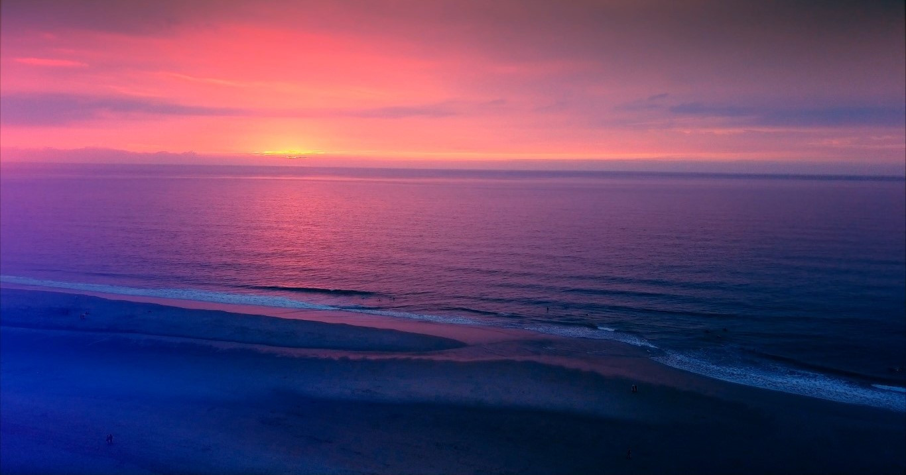
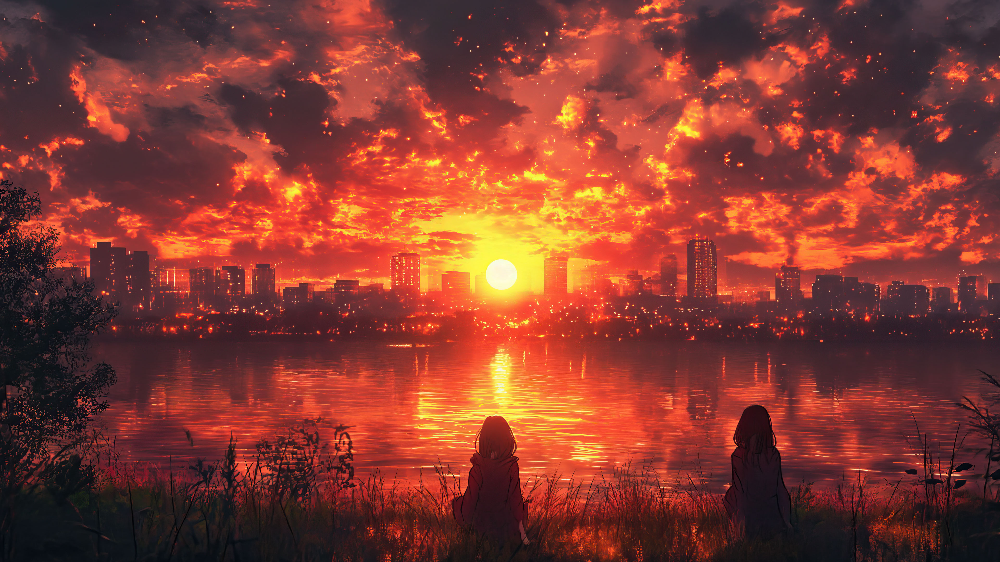
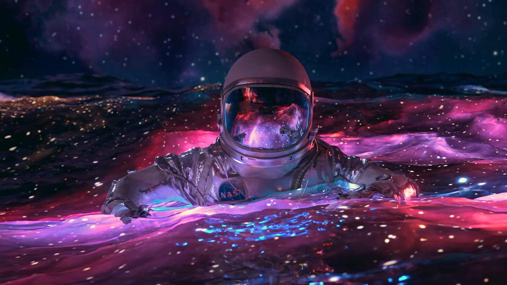
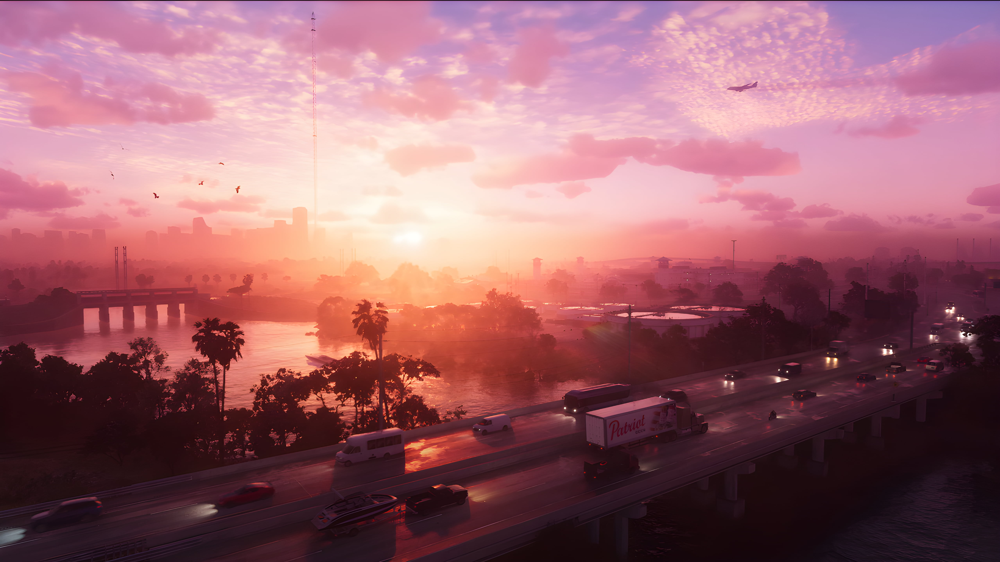

# welcome to my personal wallpaper dump
(inspired by [flicko](https://github.com/flickowoa/kabegami))  
to add your wallpapers read [commit.md](commit.md)

## previews

## dark

 

## anime

 

## colorful

 
 

## abstract

 

## minimalist

 

## space

 

## animated

 

## games

 
 

## digital art

 

## fantasy

 

## technology

 

