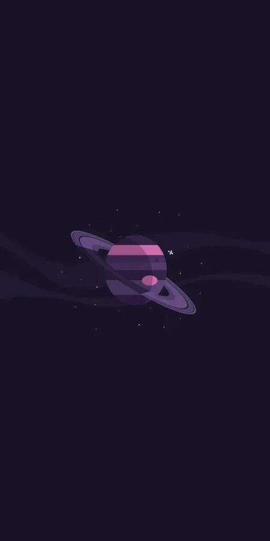
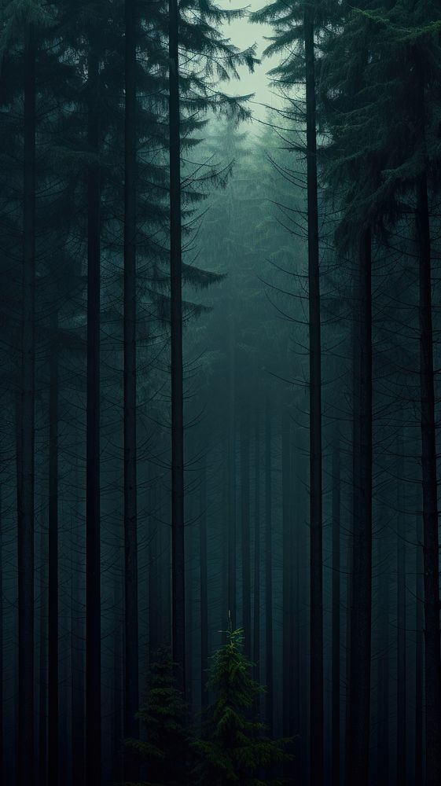

# welcome to my personal wallpaper dump
(inspired by [flicko](https://github.com/flickowoa/kabegami)) 
to add your wallpapers read [commit.md](commit.md)

## previews

## digital art

 
 

## abstract

 
 
 

## anime

 
 
 
 
 
 
 

## minimalist

 
 
 
 
 
 

## games

 
 
 
 

## animated

 

## colorful

 
 
 
 
 
 
 

## fantasy

 
 

## other

 

## space

 
 

## technology

 
 
 

## dark

 
 
 
 
 

